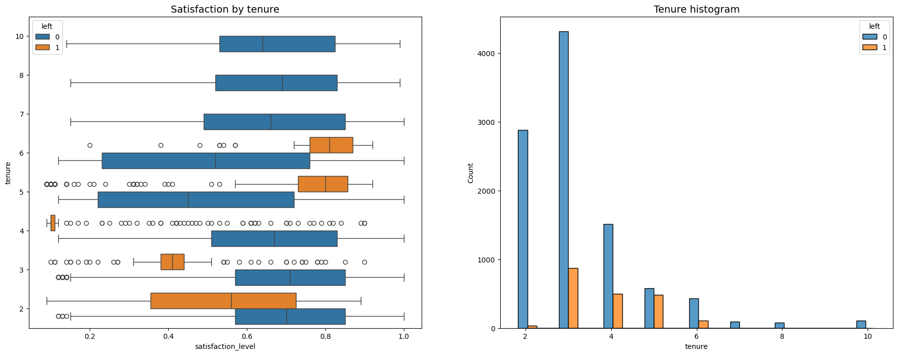
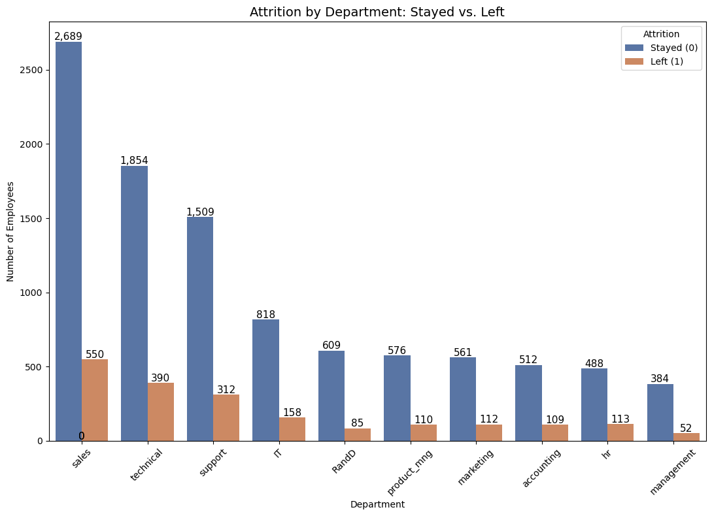
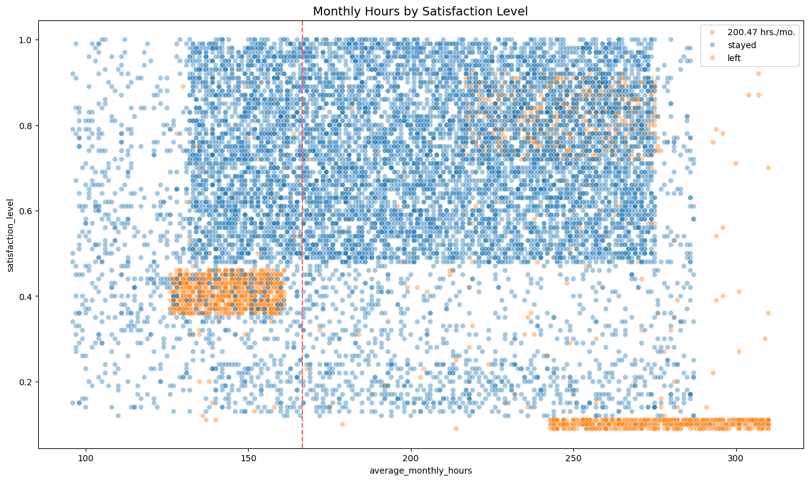
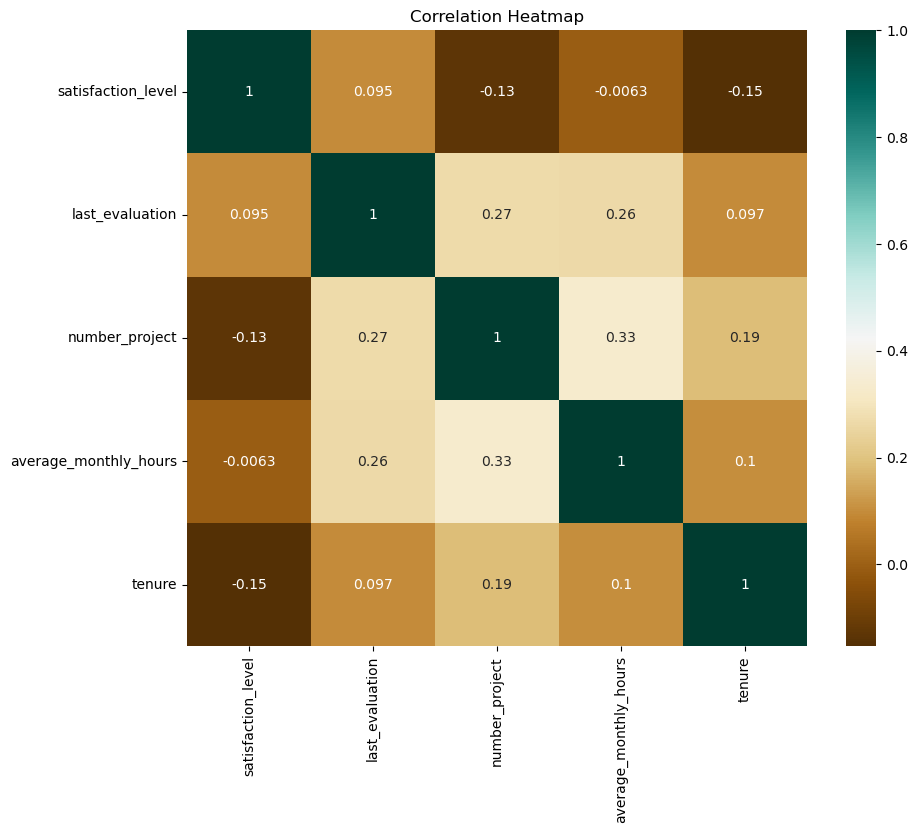
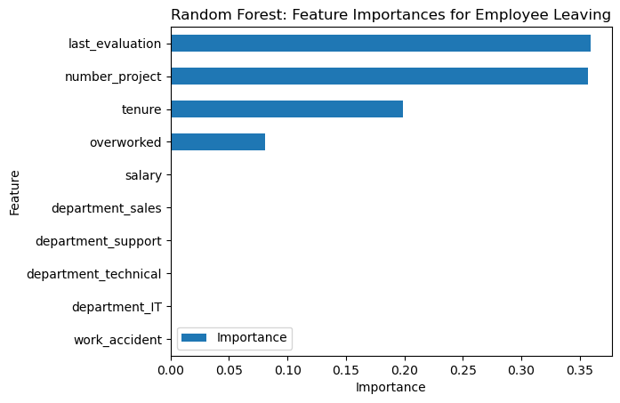

# Employee Attrition Analysis - Salifort Motors

## Problem Statement

Salifort Motors, a mid-sized automotive manufacturer, faces a high employee turnover rate. Understanding the drivers behind employee attrition is critical to improve retention and reduce hiring costs.

This project aims to:
- Identify key factors that contribute to attrition.
- Build predictive models to classify whether an employee is likely to leave.
- Provide actionable business recommendations based on the analysis.

---

## Dataset Overview

The dataset contains anonymized HR data for 12,000+ employees, including:
- Demographic and performance metrics (e.g., satisfaction level, last evaluation).
- Work-related features (e.g., average monthly hours, tenure, number of projects).
- Organizational data (e.g., department, salary level, promotion history).
- Target variable: `left` (0 = stayed, 1 = left)

---

##  Methodology

The workflow includes:

1. **Exploratory Data Analysis (EDA)**
   - Outlier detection
   - Department-level attrition trends
   - Relationships between features like tenure, satisfaction, and workload

2. **Feature Engineering**
   - Created binary flags like `overworked` for monthly hours > 175
   - Encoded categorical variables (e.g., department, salary)
   - Checked for data leakage via `last_evaluation` insights

3. **Modeling Techniques**
   - Logistic Regression
   - Decision Tree (pre- and post-feature engineering)
   - Random Forest with GridSearchCV (Round 1 and Round 2)

4. **Evaluation Metrics**
   - Accuracy, Precision, Recall, F1-score
   - ROC-AUC
   - Confusion Matrices

---

##  Key Visualizations

###  Satisfaction by Tenure

*Employees who left the company tended to have lower satisfaction levels and shorter tenure. Most satisfied long-tenured employees stayed, suggesting satisfaction is a key retention factor.*

###  Attrition by Department

*Departments such as Sales, Technical, and Support had the highest number of employees leaving. This pattern may indicate job dissatisfaction or high-pressure environments in these roles.*

###  Monthly Hours vs Satisfaction Level

*There is a clear cluster of employees with low satisfaction and extremely high or low monthly hours who left the company—indicating a possible burnout or disengagement issue.*

###  Correlation Heatmap

*Satisfaction level and number of projects show moderate correlations with attrition. Most features are weakly correlated, reinforcing the need for machine learning to capture complex interactions.*

###  Random Forest: Feature Importances for Employee Leaving

*The most important features for predicting employee attrition were last evaluation score, number of projects, and tenure. These factors likely interact in complex ways to influence whether an employee stays or leaves.*

---

##  Model Performance Summary

| Model                     | Accuracy | Precision | Recall | F1-score | AUC   |
|--------------------------|----------|-----------|--------|----------|-------|
| Logistic Regression      | 83.0%    | 80.0%     | 83.0%  | 80.0%    | -     |
| Decision Tree (Round 1)  | 97.2%    | 91.5%     | 91.7%  | 91.6%    | 96.98%|
| Random Forest (R1 - Test)| **98.1%**| **96.4%** | **91.9%**| **94.1%**| **95.64%** |
| Random Forest (R2 - Test)| 96.2%    | 87.0%     | 90.4%  | 88.7%    | 93.84%|

**Best Model:** The Round 1 Random Forest model outperformed all others across all key metrics.

---

## Business Recommendations

- **Limit Project Load**: Cap project assignments to reduce burnout.
- **Improve Promotion Policies**: Employees with no promotion in 5 years are more likely to leave.
- **Clarify Overtime Expectations**: Many leavers worked >200 hours/month.
- **Address Tenure Dissatisfaction**: Employees with 2–4 years of service show higher attrition.
- **Evaluate Evaluation Bias**: Over-reliance on `last_evaluation` may mask true performance trends.

---

## Next Steps
- Build a dashboard for real-time attrition risk monitoring.
- Remove `last_evaluation` in alternative models to check for leakage.

